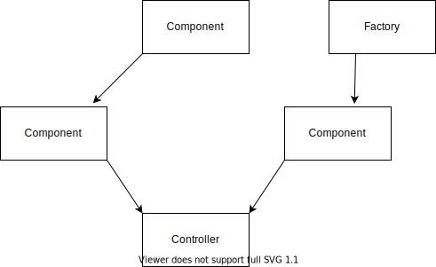
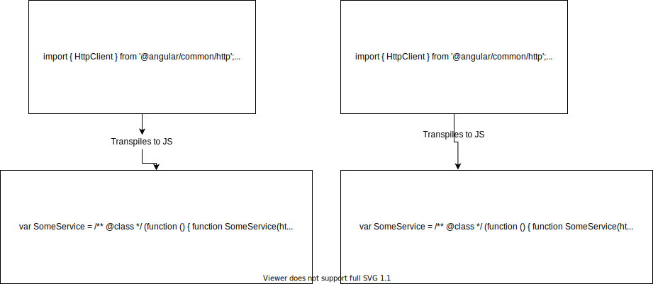
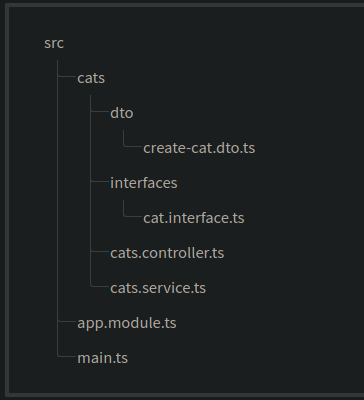

>## Providers ## 
* Controllers should handle HTTP requests and delegate more complex tasks to providers. Providers are plain JavaScript classes that are declared as providers in a module.
* We can then Inject this service/provider inside controller and hence making code scalable and easy to maintain.


```
interface Animal{
    sound():string;
}
```
```
import { Injectable } from '@nestjs/common';
@Injectable()
class CatService implements Animal{
    public sound():string{
        return 'Mew';
    }
}
```
```
import { Injectable } from '@nestjs/common';
@Injectable()
class DogService implements Animal{
    public sound():string{
       return 'Bark';
    }

}
```
```
import { Injectable } from '@nestjs/common';
@Injectable()
class LionService implements Animal{
    public sound():string{
       return 'Roar';
    }

}
```
> **The benefit of using private keyword while injecting any service is that It allows us to define as well as initialize all members of  injected class immediately at the same location.**
```
import { Injectable } from '@nestjs/common';
import {Animal} './interface/Animal.interface.ts'
@Controller('animal') 
class AnimalController {
    Constructor(private animal:Animal){}
    @Get('/sound')
    public sound():string{
        return animal.sound();
    }
}
```
### Provider description: ###

```
import { Injectable } from '@nestjs/common';
@Injectable()
class CatService implements Animal{
    public sound():string{
        return 'Mew';
    }
}
```
As you can see above code(of service/provider), everything is like a normal class except one decorator: 
  
> ## @Injectable() ##
In Nest, thanks to TypeScript capabilities, it's extremely easy to manage dependencies because they are resolved just by type but here comes a problem because every typescript file is transpiled to **Javascript** files and we know that **Javascript** doesn't contain type as it is dynamically typed.

Hence, how do the compiler know which service to inject. Here comes role of **@Injectable()** decorator which is going to add metadata information to our transpiled class to make sure that the type information that is needed to identify the which service to inject is not lost.

for more information, visit [here](https://blog.strongbrew.io/the-injectable-decorator-and-di/
)



### Note ### 
> **@Injectable()** is only used to tell nest which dependency are required not to register the service above which class is written.
```
@Injectable() 
class Zoom{
    constructor(private meet:Meet){}
}
```
@Injectable() is used by Nest to tell that Meet service is being Injected inside Zoom class not to register the Zoom class.

Hence, we can conclude that 
**@Injectable()** is not needed all the time but it is needed when we are using Dependency Injection concept. Although it is highly recommended to use it all the time, because when we are not doing dependency Injection(DI), it will be ignored but for DI it is mandatory.

> **Who resolves the relationship among providers?**

**Ans:** Nest inbuilt Inversion of Control(IOC) container.

> ## IOC: ##

Inversion of control container is used to resolve the relationship among various providers. It lies underneath of Dependency Injection.

What it says is that the objects don't create other objects on which they rely on for their work. Instead an external source is used to create those objects(In our case Nest framework itself.). Now you get it that IOC forms the basis for Dependency Injection where, we don't need to create objects on which we are dependent, instead we just directly inject them via type. Nest creates/Instantiate the objects and give it's sources to dependent objects to use.

**@Optional()** decorator can be used while injecting optional dependencies(meaning if we pass some value it will be injected otherwise some default value will be injected.)

```
import { Injectable } from '@nestjs/common';
import {Animal} './interface/Animal.interface.ts'
@Controller('animal')
class AnimalController {
    Constructor(@Optional() @Inject('something to pass') private animal:Animal){}
    @Get('/sound')
    public sound():string{
        return animal.sound();
    }
}
```

### Property based Injection ### 
Only use When our high level class depends and low level class and so on(multilevel Inheritance), it becomes very difficult to use Constructor based DI because of calls to super() keyword for base parent classes( But we should avoid this case and we can do that using SOLID principles=> **Dependency Inversion Principle.**), hence we use property based injection for that.
```
import { Injectable } from '@nestjs/common';
import {Animal} './interface/Animal.interface.ts'
@Controller('animal')
class AnimalController {
    @Inject()
    private animal:Animal;
    @Get('/sound')
    public sound():string{
        return animal.sound();
    }
}
```
Now to perform injection/to use the service, we need to register it with Nest which we can do by importing service inside app.module.ts
```
@Module(){
    providers:[CatService]
    controllers:[CatController]
}
```

## Recommended Folder Structure: ## 

* However, we should separate Interface folder, make an Interface folder, directory inside src and put all required interfaces there.

So far we have discussed that Nest automatically handles dependencies but there might be some cases where we have to manage and instantiate dependencies manually which we will learn in coming chapters.

Find more [here](https://docs.nestjs.com/providers#provider-registration)