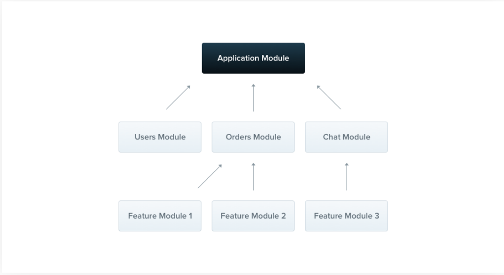
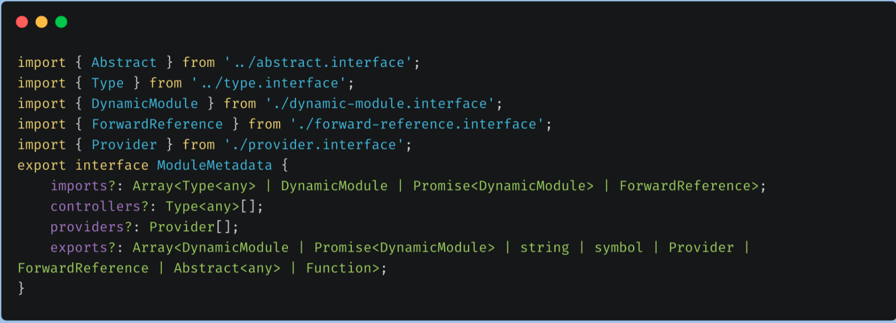

> ## Module ## 
A module provides metadata which Nest uses to organize structure of your application.

Any class annotated with **@Module()** decorator is called as module.



- Each Nest application has at least one root module(**In our case app.module.ts**) from where Nest starts build our application graph(Internal data structure which Nest uses to resolved modules and providers relationship and dependencies.)
- Nest Modules are like containers which can contain different components, service providers, pipes etc and now scope of these components, service providers, pipes etc will be defined by containing module.
- They can import functionality that is exported from other modules, and export selected functionality for use by other modules. Thus, for most applications, the resulting architecture contains multiple modules, each encapsulating a set of functionalities.

> **Note:** It is strongly recommended to use modules because these provides effective way to organize our application structure.

```
import { Module } from '@nestjs/common';
import { CatsController } from './cats.controller';
import { CatsService } from './cats.service';

@Module({
  controllers: [CatsController], // all controllers inside this array.
  providers: [CatsService], // all services inside this array
})
export class CatsModule {}
```
* This **CatsModule** will organize code for specific features(such as CatService) and set appropriate boundaries for providers. Hence making it easy for us to maintain and scale.
* Now, we have the CatsModule, we need to import this module inside root module so that **Nest** can use it.
  
```
import {Module} from "@nestjs/common";
import {CatsModule} from './Cat/Cat.module.ts';
@Module({
    imports:[CatsModule]
})
export class AppModule{}
```
---
**@Module()** takes a single object of type ModuleMetaData which contains four parts:
* **imports** — the set of the ‘imported’ modules.
* **controllers** — the list of controllers. (e.g. HTTP controllers)
* **providers** — the list of providers that belong to this module. They can be injected between themselves.
* **exports** — the set of components, which should be available for modules, which imports this module.



## Shared modules ##
When our application is huge/complex, we try dividing features into multiple different feature modules.
Now, we know that every framework provides some common modules, hence instead of importing these common modules again and again inside all feature modules, what we could do is, create a single module and put all common modules/components inside it and then import this single module wherever required.

This saves time/lines of code and ease our life in find bugs.
> * In **Nest** every module is singleton class and hence we can share same instance of provider across all modules.
> * Every module is shared module in **Nest** be default.

Let's imagine that we want to share an instance of the CatsService between several other modules. In order to do that, we first need to export the CatsService provider by adding it to the module's exports array.
```
import { Module } from '@nestjs/common';
import { CatsController } from './cats.controller';
import { CatsService } from './cats.service';

@Module({
  controllers: [CatsController],
  providers: [CatsService],
  exports: [CatsService]
})
export class CatsModule {}

```
Now any module that imports the CatsModule has access to the CatsService and will share the same instance with all other modules that import it as well.

> **Export Provider, Import Module.**

# Implementation: #

**test.module.ts:**
```
import { Module } from '@nestjs/common';
import { TestService } from './test.service';

@Module({
  providers: [TestService],
  exports: [TestService], // Export TestService here so that other modules can use it by importing module
  // of test==> TstModule
})
export class TestModule {}

```
**sub-test.module.ts**
```
import { TestModule } from './../test/test.module';
import { Module } from '@nestjs/common';
import { SubTestService } from './sub-test.service';

@Module({
  providers: [SubTestService],
  imports: [TestModule], // Gives us Access to use TestService, Since TestService is already exported in TestModule
})
export class SubTestModule {}

```
---
Now we can Inject TestService inside SubTestService.

**sub-test.service.ts**
```
import { TestService } from './../test/test.service';
import { Injectable } from '@nestjs/common';
@Injectable()
export class SubTestService {
  constructor(private readonly subTest: TestService) {}
  public getToken(): string {
    return this.subTest.getTest();
    }
}

```
## Module re-exporting ##
Modules can export their internal providers. In addition, they can re-export modules that they import.

## Global Modules ##
When you want to provide a set of providers which should be available everywhere out-of-the-box (e.g., helpers, database connections, etc.), make the module global with the **@Global()** decorator. The **@Global()** decorator makes the module global-scoped. Global modules should be registered only once, generally by the root or core module.

But using Global Module concept is not recommended. Use shared module concept only.