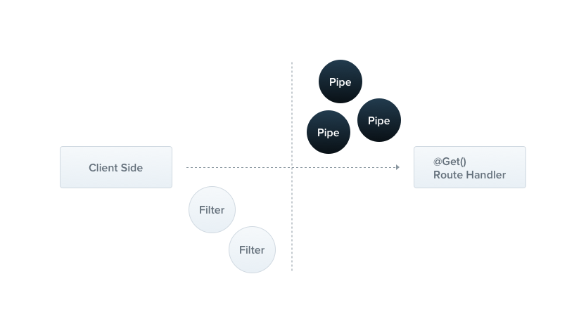

# Pipe: #

A pipe is a class annotated with the @Injectable() decorator. Pipes implement the **PipeTransforminterface**. 

Pipes have two typical use cases:
1. **transformation**: transform input data to the desired form (e.g., from string to integer)
2. **validation**: evaluate input data and if valid, simply pass it through unchanged; otherwise, throw an exception when the data is incorrect
---
* In both cases, pipes operate on the arguments being processed by a **controller route handler**(Basically body which we pass in DTO).
* Nest interposes a pipe jus before a method is invoked, then this pipe receives the input arguments(DTO) and operates/validates on them to provide desired output.
> **Pipes run inside the exceptions zone. This means that when a Pipe throws an exception it is handled by the exceptions layer. Now, it should be clear that when an exception is thrown in a Pipe, no controller method is subsequently executed. This gives you a best-practice technique for validating data coming into the application from external sources at the system boundary.**
```
Let's say, Someone is passing some data to create an entry of data coming from external source to create entry, then in that case to verify whether we are getting correct data(in terms of formate and structure), pipe is going to check is just before route inside a controller is invoked and hence making it great use case of data validation. 
```
## Built-in pipes: ##
Nest comes with six pipes available out-of-the-box:
- **ValidationPipe:** 
- **ParseIntPipe**
- **ParseBoolPipe**
- **ParseArrayPipe**
- **ParseUUIDPipe**
- **DefaultValuePipe**

They're exported from the @nestjs/common package.
### ParseIntPipe: ###
```
@Get(':id')
async findOne(@Param('id', ParseIntPipe) id: number) {
    return this.catsService.findOne(id);
}
/*
 Here ParseIntPipe ensures that the id passed is number only otherwise it throws an exception saying that:
{
    "statusCode": 400,
    "message": "Validation failed (numeric string is expected)",
    "error": "Bad Request"
}
Hence it will prevent findOne() method from executing.
*/
```
---
## Custom Pipe: ##
Like Angular, eery pipe in Nest has to implement a **transform()** method which takes two arguments:
1. value // which we pass from outside/user side
2. metadata
```
import { ArgumentMetadata, Injectable, PipeTransform } from '@nestjs/common';
@Injectable()
export class DataTransformationPipe implements PipeTransform {
    transform(value: any, metadata: ArgumentMetadata) {
        return value; // here perform logic transformation
    }
}

To use this pipe we need to pass it inside @Body() decorator in the respective routes of  controller.

@Body(DataTransformationPipe)
or 
@Get('/somePath)
@usePipes(new DataTransformationPipe())
public methodName(@Body() createCatDto: CreateCatDto){
   |
   |
   |
}
```
### ArgumentMetadata: ### 
It is an interface which contains three parts:
1. **type** : 'body' | 'query' | 'param' | 'custom'; // whatever parameter type we pass decides type
@Body() ===> body
@Param() ==> param
@Query() ==> query
2. **metatype?**: Type<unknown>; // Metatype of parameter passed. Exp: string
3. **data?**: string; // Gives whatever string data we pass inside @Param(), @Body(), @Query()
   @Body('My name') // data= My name
