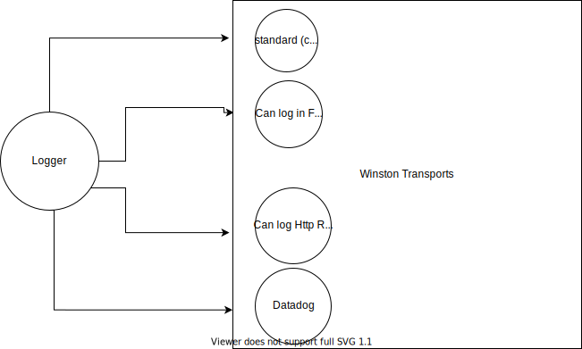

## Log Levels:(0,1,2,3,4,5,6) ##
- error: 0
- warn : 1
- info : 2
- http : 3
- verbose : 4
- debug : 5
- silly : 6
  
> **Note: Default log level is info**
---
Now you can set the log level globally and the idea is that whatever log level you have set, it is going to consider that level and the levels below that log level.
> **Example**: For info logger, it will write out all messages for error, warn and info levels only.
- The above statement is very useful while finding a bug. Let's say we want to find all the errors, hence we are going to change global configuration of log to **error**. Now it will only write our all the errors.
- When I will run debug logger, hence in that case it will write out all errors, warnings, info, http, verbose and debug logs.

```
$ npm i winston
```